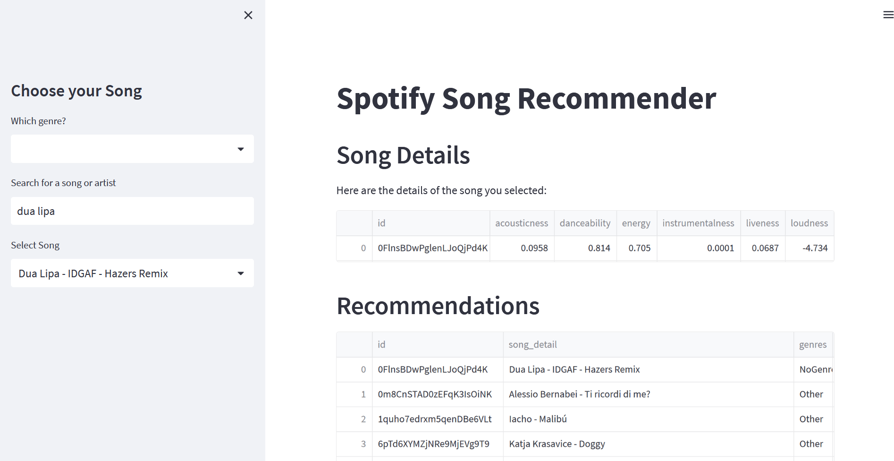
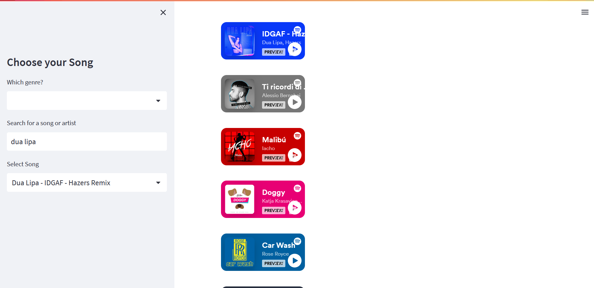

# Spotify Song Recommendation

This is a small end-to-end data science project, containing a dagster pipeline, a scikit-learn knn model and a streamlit frontend webapp. See the jupyter notebook for the complete pipeline with some explanations. 

My focus was more on the data engineering side, as I wanted to try out `duckdb` and `polars`. I am amazed at the speed of both tools and find data manipulation easier with `sql` and the `polars` API. Coming from an `R tidyverse` background the `pandas` API never really clicked with me and I find myself constantly googling stuff.

`Dagster` was a bit of a pain to install with `streamlit`, ultimately isolating both in separate environments. `Dagster` has a nice API if you do standard things with it, which I didn't... Usually all jobs and ops run in parallel or in sequence if you specify inputs and outputs. My ops were all in the database with no inputs and outputs, but needed to run in the right order. The solution was buried in the docs: Use the decorator `@op(ins={"start": In(Nothing)})` and specify the jobs like `second_op(start=first_op())`. 

The knn algorithm is working though I don't find it particularly useful with song recommendations. The idea was to use the standard set of song features (danceability, energy, loudness, ...) and a KNN classifier to predict the genre. There are thousands of different genres, so I used the top 20 by count and aggregated the rest into an "other" class. 

`streamlit` is easy to get started, but there is too much magic going on, making it hard to use advanced features. Especially two-way binding of a select box was difficult to achieve. 


## Installation 

```sh
conda create -n spotify_env python=3.10
conda activate spotify_env
pip install -r requirements.txt
```

## Run

Make sure to first run the dagster pipeline or the jupyter notebook, before running the streamlit app.

```sh
conda activate spotify_env

dagster dev -f pipeline.py
streamlit run app.py
```




